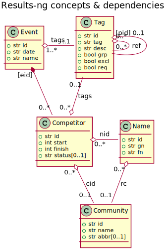

# results - web-based timing and scoring software for ski- and running races

Completely re-written, but still ever-lasting...

UI is now react-based, backend on the other hand written by python3. UI is still based on AJAX/REST API, while the notifications will be submitted through SocketIO (fundamentally either by long-polling, or preferably via websocket) by using home-made *RCNP* (Resource Change Notification Protocol). Additionally HTTP PATCH will be supported for partial entity updates (this has also introduced new verb 'PATCH' to RCNP).

## The backend

The backend requires bunch of libraies such as [Flask](http://flask.pocoo.org/) for serving static web files, [Flask-RESTful](https://flask-restful.readthedocs.io/) for REST, and [Flask-SocketIO](https://flask-socketio.readthedocs.io/) for SocketIO implementation required for *RCNP*. The database will be most probably implemented with sqlite (let's see). All in all the dependencies will be maintained in the code itself while using some python package manager to resolve them (TBD).

## The frontend

The frontend is based on [React](https://reactjs.org/), and the state management is following [MEIOSIS](https://meiosis.js.org) -pattern by utilizing [flyd](https://github.com/paldepind/flyd) and [Patchinko](https://github.com/barneycarroll/patchinko). I did some investigation of commonly used state management libraries such as Redux and Mobx, but it quickly seemed far too tedious to get grip of them, as I'm still a bit newbie with js. Besides, doing it on my own way sound much more fun! 

Of course the app has lot more dependencies, but they're all included in the [package.json](webui/webpack.json) -file. The building is based on webpack, by typing:


```
# cd webui
# npm run dev
```

## About the data model



*Event* as a concept is no doubt self-explanatory. An *Event* may specify *Tags*
either directly by having *Tags* `id` directly in the `tags` -attribute,
or indirectly if the *Tag* is children or belongs to the chain of children of
a direct *Tag* of an *Event*. The same *Tag* may be specified by more than one
*Event*, which might be useful in case of series of events ("multi-day-events").
However, when a *Tag* is no longer specified by any *Event*, directly or indirectly,
it shall be removed. The *Tags* specified - directly or indirectly - of an individual
*Event* are said to be in "the scope of that *Event*". A *Tag* may have children only
if it's `grp` (group) -attribute is set to `true`. A *Tag* of group -kind may be
"exclusive" (i.e. the attribute `excl` is set to `true`) indicating, that only one
of the *Tags* within the group may be set at once. For groups, attribute `req` with
value `true` means, that at least one of the children must be set (usefull for
specifying *Tags* representing competition class). For non-groups, the `req` means
that the *Tag* must be set in order to proceed (e.g. with registration, as the *Tag*
may indicate that the registration fee has been payd).

*Tag* may also "refer" to another *Tags* within the scope of enclosing *Event* (see above).
*Tag* refers to another by having it's `id` in `refs` attribute. The feature is useful
for "linking traits". For example *Tag* `M21` (competition class) may refer to *Tag*
`AM 10:30` indicating, that if `M21` is set, the starting time is `AM 10:30`. If `M21`
is removed, `AM 10:30` still remains. If `AM 10:30` is removed, it's `id` will be
cleared from the `M21`'s `refs` attribute.

*Competitor* represents a person's registration to an *Event*. The life-time
of the *Competitor* is bound to the life-time of the *Event*. When the 
*Event* is removed, also the *Competitors* will be removed. A *Name*
represents the individual person (having a name). Obviously the same
person (i.e. the *Name*) may participate to multiple *Events*. However,
the *Name* will not be removed when the last *Compeitor* referring it
is removed, as the it is very much possible that the same person
will partcipate to some other *Events* later. In that case, it is 
handy for the user if the *Name* is still available, so that there's
no need to type in again (but just choose from auto-completed list etc).

Finally, the *Community* represents the community that the person is
representing in the particular *Event*. *Community* as an attribute of
*Competitor* is optional, as the person may not represent anything other
than him- or herself. The *Name* may also be associated with the most recently
represented *Community*. This helps user to fill in registrations, as the
most recently represented *Community* may be automatically offered when
filling in the registration form. Of course it is possible for the person
to represent different *Communities*.

## Running it

Once compiled, type:

```
# cd webui
# FLASK_APP=../server/app/server.py python -m flask run
```

Then navigate to address `http://localhost:5000`

## Testing the backend

Test the code and have a coverage report (in directory `cov_report`):

```
# cd server
# FLASK_APP=app/server.py python -m pytest --cov=. --cov-report html:cov_report tests/
```

(No need to have coverage? Just skip the `--cov=. tests/` -part).


